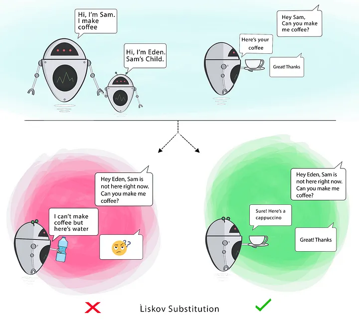

# Liskov Substitution Principle

If S is a subtype of T, then objects of type T in a program may be replaced with objects of type S without altering any of the desirable properties of that program.

**When a child Class cannot perform the same actions as its parent Class, this can cause bugs**.

If you have a Class and create another Class from it, it becomes a parent and the new Class becomes a child.

**The child Class should be able to do everything the parent Class can do**. This process is called **Inheritance.**

The child Class should be able to process the same requests and deliver the same result as the parent Class or it could deliver a result that is of the same type.

This principle aims to enforce consistency so that the **parent Class or its child Class can be used in the same way without any errors**.

1) It helps to avoid misusing of inheritance
2) It help us conform to the 'is-a' relationship
3) The child classe must fulfill a contract defined by the parent class